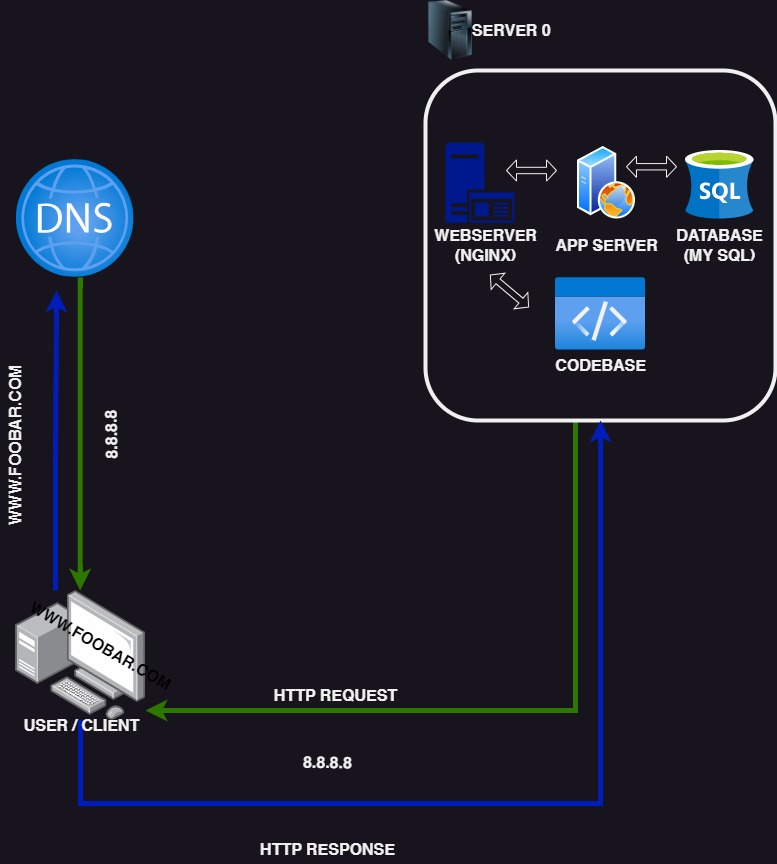

# Simple Web Stack

[Visit Board](https://imgur.com/cZanpGP)

## Description

This is a basic web infrastructure that hosts a website accessible through `www.foobar.com`. There are no firewalls or SSL certificates implemented for securing the server's network. Each component (database, application server) shares the resources (CPU, RAM, and storage) provided by the server.

## Infrastructure Components

+ A server is a computer system (hardware or software) that provides services to other computers, known as clients.  

+ A domain name acts as a user-friendly alias for an IP address. For example, `www.wikipedia.org` is easier to remember than `91.198.174.192`. The domain name and IP address mapping is handled by the Domain Name System (DNS).  

+ The `www` in `www.foobar.com` is an A record. This can be verified by running `dig www.foobar.com`. An A record maps a hostname to an IPv4 address.  

+ A web server is a software or hardware component that handles HTTP or HTTPS requests and responds with the requested resource or an error message.  

+ An application server hosts and operates applications and related services for end-users, IT services, and organizations.  

+ A database stores and manages organized data that can be easily accessed, managed, and updated.  

+ The server communicates with the client (user's computer requesting the website) over the internet using the TCP/IP protocol suite.  

## Potential Issues

+ Single Point of Failure (SPOF): If any component (e.g., MySQL database server) fails, the entire site would be down.  

+ Downtime during maintenance: When performing maintenance on any component, it would need to be taken offline or the server would need to be shut down, causing downtime for the website.  

+ Limited scalability: With a single server hosting all components, it can quickly run out of resources or become slow when handling a large volume of requests, making it difficult to scale the infrastructure.
