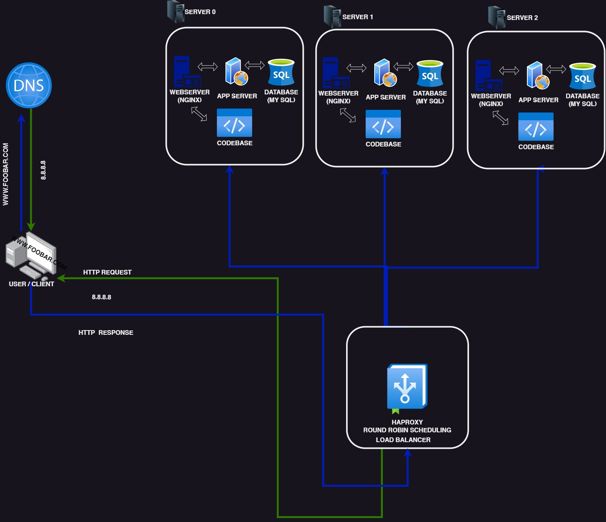

# Distributed Web Infrastructure

[Visit Board](https://imgur.com/a/nWO7If7)

## Description

This is a distributed web infrastructure that attempts to reduce the traffic to the primary server by distributing some of the load to a replica server with the aid of a server responsible for balancing the load between the two servers (primary and replica).

## Specifics About This Infrastructure

+ The distribution algorithm the load balancer is configured with and how it works. The HAProxy load balancer is configured with the _Round Robin_ distribution algorithm. This algorithm works by using each server behind the load balancer in turns, according to their weights. It's also probably the smoothest and most fair algorithm as the servers' processing time stays equally distributed. As a dynamic algorithm, _Round Robin_ allows server weights to be adjusted on the go.  

+ The setup enabled by the load-balancer. The HAProxy load-balancer is enabling an _Active-Passive_ setup rather than an _Active-Active_ setup. In an _Active-Active_ setup, the load balancer distributes workloads across all nodes to prevent any single node from getting overloaded, improving throughput and response times. In an _Active-Passive_ setup, not all nodes are active and capable of receiving workloads at all times. If one node is active, the other node must be passive or on standby. The passive node can become active if the preceding node becomes inactive.  

+ How a database _Primary-Replica_ (_Master-Slave_) cluster works. A _Primary-Replica_ setup configures one server to act as the _Primary_ server, and the other server to act as a _Replica_ of the _Primary_ server. The _Primary_ server can perform read/write requests, while the _Replica_ server can only perform read requests. Data is synchronized between the _Primary_ and _Replica_ servers whenever the _Primary_ server executes a write operation.  

+ The difference between the _Primary_ node and the _Replica_ node regarding the application. The _Primary_ node is responsible for all the write operations the site needs, while the _Replica_ node can process read operations, decreasing the read traffic to the _Primary_ node.  

## Issues With This Infrastructure

+ Single Point of Failure (SPOF). If the Primary MySQL database server is down, the entire site would be unable to make changes (including adding or removing users). The server containing the load balancer and the application server connecting to the primary database server are also SPOFs.  

+ Security issues. The data transmitted over the network isn't encrypted using an SSL certificate, so hackers can spy on the network. There is no way of blocking unauthorized IPs since there's no firewall installed on any server.  

+ No monitoring. There is no way of knowing the status of each server since they're not being monitored.
