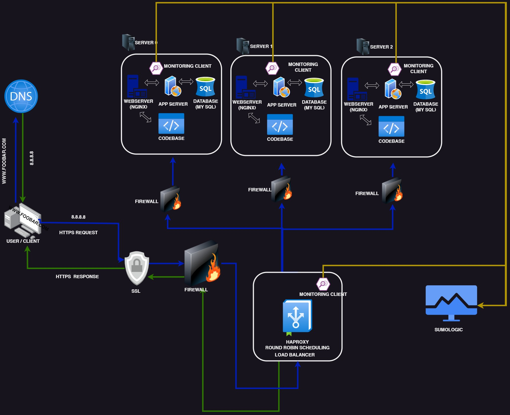

# Secure and Monitored Web Infrastructure

[Visit Board](https://imgur.com/a/J1wYklh)

## Description

This is a web infrastructure consisting of three servers, designed to be secure, monitored, and serve encrypted traffic.

## Infrastructure Components

+ Firewalls are implemented to protect the network and servers from unauthorized access and malicious traffic. They act as a barrier between the internal network and the external network, blocking incoming traffic that matches predefined rules or criteria.

+ SSL (Secure Sockets Layer) certificates are used to encrypt the traffic between the web servers and the external network. This encryption prevents eavesdropping, man-in-the-middle attacks, and protects sensitive information from being intercepted by network sniffers. SSL certificates ensure data privacy, integrity, and authentication.

+ Monitoring clients are deployed to continuously monitor the servers and the external network. They analyze server performance, operations, and overall health. If any issues or deviations from expected behavior are detected, the monitoring clients alert the administrators. Key metrics, such as server accessibility, response times, file integrity, security vulnerabilities, and other potential issues, are tracked and reported.

## Potential Issues

+ Terminating SSL encryption at the load balancer level would leave the traffic between the load balancer and the web servers unencrypted, potentially compromising data security.

+ Having a single MySQL server poses a scalability issue and introduces a single point of failure for the web infrastructure's database operations.

+ Hosting all components (web servers, application servers, databases) on servers with identical configurations can lead to resource contention (CPU, memory, I/O) and performance degradation. Additionally, it makes it challenging to isolate and identify the root cause of issues. This setup is not easily scalable or maintainable.
