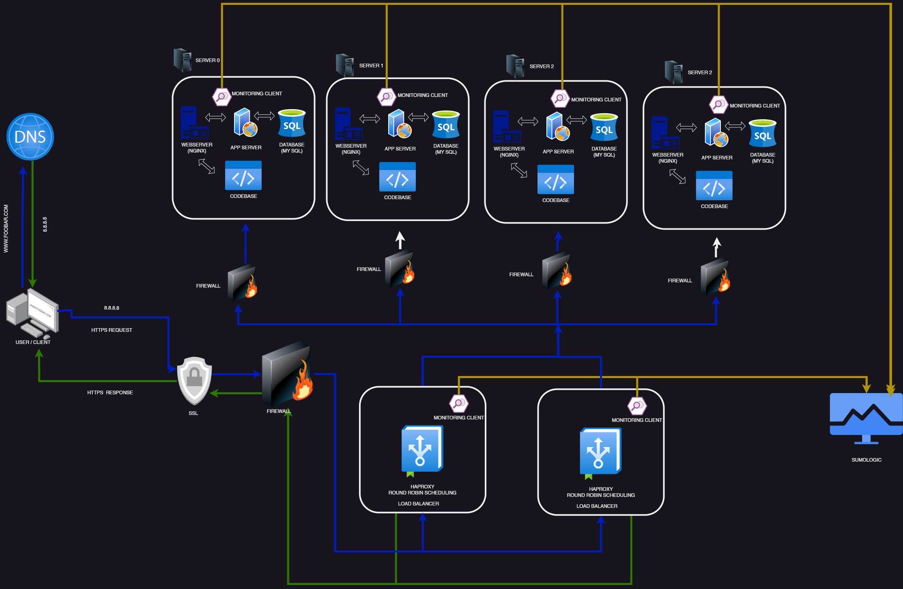

# Highly Scalable Web Infrastructure

[Visit Board](https://imgur.com/a/oZEWdXX)

## Description

This web infrastructure is designed to be highly scalable and fault-tolerant. It builds upon the previous infrastructure by distributing critical components across multiple dedicated servers. Each major component, including web servers, application servers, and database servers, is hosted on separate GNU/Linux servers. This architecture eliminates single points of failure and allows for independent scaling and maintenance of each component.

## Key Features

+ Dedicated firewalls are implemented for each server, providing an additional layer of security and protection against unauthorized access and malicious traffic targeting individual components.

+ SSL encryption is maintained end-to-end, ensuring secure communication between clients and web servers, as well as between various internal components.

+ Comprehensive monitoring is implemented across all servers and components, enabling proactive identification and resolution of performance issues or potential failures.

## Potential Considerations

+ Increased infrastructure complexity and maintenance requirements due to the larger number of servers and components involved.

+ Higher upfront costs associated with acquiring additional hardware resources (servers, networking equipment, etc.) to support the scaled-up architecture.

+ Increased energy consumption and operating costs due to the need to power and maintain multiple dedicated servers.

While this scaled-up infrastructure offers improved scalability, fault tolerance, and security, it also introduces additional complexities and costs that need to be carefully evaluated and managed.
